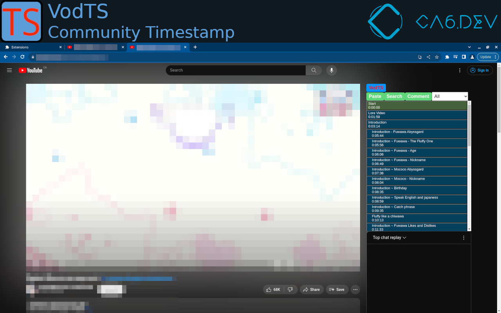
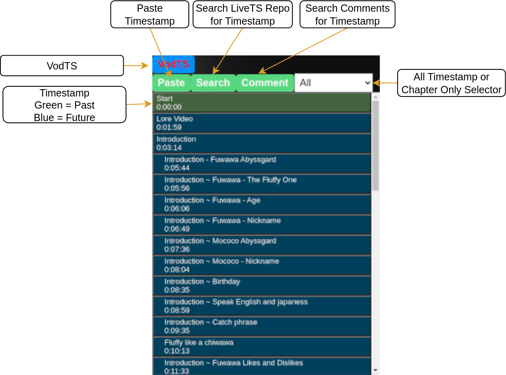

# VodTS-chrome
Chrome extension for reading LiveTS files  

## How to get the code from github
- follow the link to the repo (well you are here already)
- download the code using the green "Code" button, then click on "Download ZIP"
- extract the download zip

## How to install on chrome
- open chrome://extensions/ (remplace chrome with edge, opera, vivaldi if using one of those)
- enable developer mode
- load unpacked
- load the extension from the src folder in the folder downloaded from github

## How to use VodTS
- open a youtube vod page
- click on the VodTS icon above chat
- click paste if you have the timestamp in your clipboard
- click search to search in LiveTS timestamp repo
- click comment to search in youtube comment (comment need to be loaded by scrooling in the page)  

## Browser Support
| Feature / Browser      | Chromium | Chrome | Brave | Edge     | Opera    | Firefox |
|------------------------|----------|--------|-------|----------|----------|---------|
| Display Timestamp      | YES      | YES    | YES   | Untested | Untested | Planned for V1.1.0 |
| Jump to Time           | YES      | YES    | YES   | Untested | Untested | Planned for V1.1.0 |
| Paste from Clipboard   | YES      | YES    | YES   | Untested | Untested | Planned for V1.1.0 |
| Search LiveTS Repo     | YES      | YES    | YES   | Untested | Untested | Planned for V1.1.0 |
| Search Comment Section | YES      | YES    | No    | Untested | Untested | Planned for V1.1.0 |

## Platform Support
|                        | Youtube | Twitch             | VStream            |
|------------------------|---------|--------------------|--------------------|
| Display Timestamp      | YES     | Planned for V1.2.0 | Planned for V1.3.0 |
| Jump to Time           | YES     | Planned for V1.2.0 | Planned for V1.3.0 |
| Paste from Clipboard   | YES     | Planned for V1.2.0 | Planned for V1.3.0 |
| Search LiveTS Repo     | YES     | Planned for V1.2.0 | Planned for V1.3.0 |
| Search Comment Section | YES     | No                 | No                 |

## Roadmap
TODO